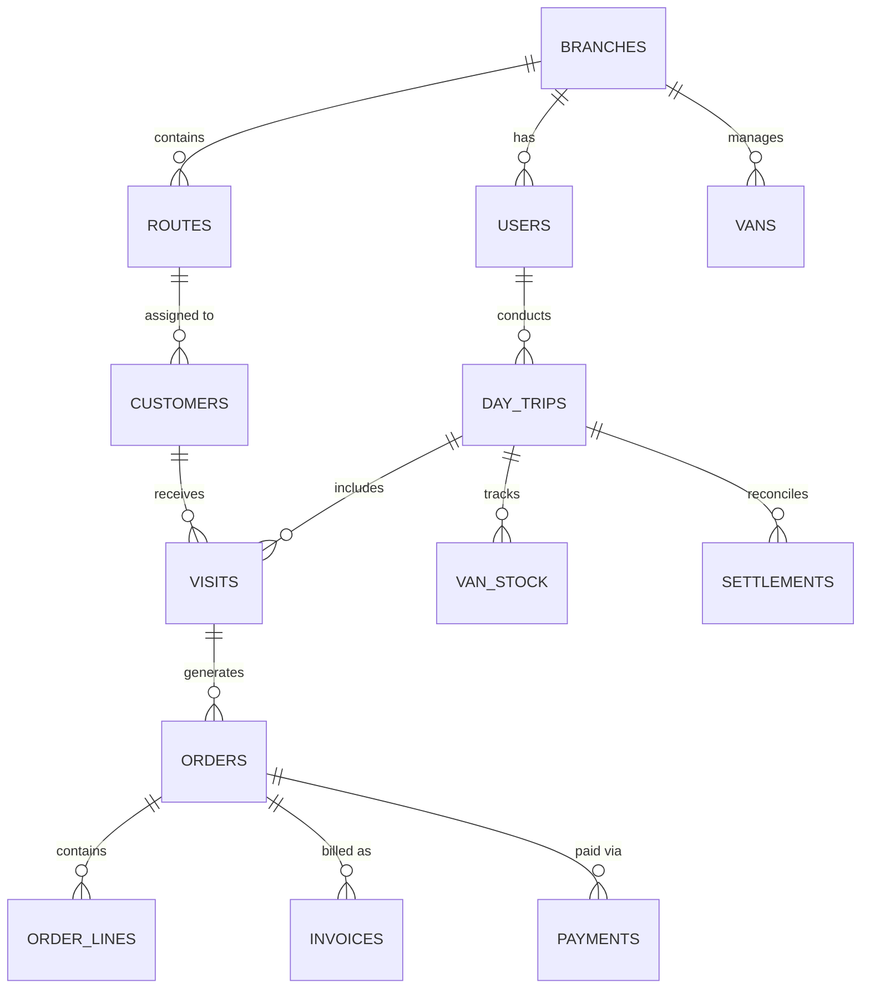

# Central Database Architecture & Schema — PostgreSQL

This document details the PostgreSQL system-of-record database schema for the **Bisleri Van Sales & Distribution System**. 

The backend is built with **NestJS** and **Drizzle ORM**. The schema is defined in [schema.ts](file:///Users/nippunrana/Downloads/Bisleri/backend/src/db/schema.ts).

---

## 1. System Overview & Technology Stack

* **Database Engine:** PostgreSQL (Azure Flexible Server)
* **ORM:** Drizzle ORM (`drizzle-orm/pg-core`)
* **Primary Keys:** UUID v4 (`defaultRandom()`)
* **Timestamps:** Standard ISO-8601 with timezone (`timestamp with time zone`)
* **Quantities:** Stored in base unit of measure (**PIECES / Pcs**). Conversion to Cases via `items.pcs_per_case`.
* **Currency:** INR rounded to 2 decimal places.

---

## 2. Entity Relationship Diagram (High-Level)

---

## 3. Schema Documentation by Subsystem

### 3.1. Identity & Territory Management

#### `branches`
Represents regional distribution centers or sales branches.
| Column | Type | Constraints | Description |
| :--- | :--- | :--- | :--- |
| `id` | `uuid` | `PK`, Default random | Unique branch identifier |
| `code` | `text` | `NOT NULL`, `UNIQUE` | Branch code (e.g. `PUN_01`) |
| `name` | `text` | `NOT NULL` | Full branch name |
| `invoicePrefix` | `text` | `NOT NULL` | Prefix used for invoices (e.g. `MI`, `RI`) |
| `isActive` | `boolean` | `NOT NULL`, Default `true` | Branch status flag |
| `createdAt` | `timestamp` | `NOT NULL`, Default `now()` | Record creation timestamp |
| `updatedAt` | `timestamp` | `NOT NULL`, Default `now()` | Last modification timestamp |

#### `users`
System users including Van Sales Representatives (Reps), Supervisors, and Admins.
| Column | Type | Constraints | Description |
| :--- | :--- | :--- | :--- |
| `id` | `uuid` | `PK`, Default random | Unique user identifier |
| `erpUserCode` | `text` | `NOT NULL`, `UNIQUE` | ERP user code |
| `name` | `text` | `NOT NULL` | User full name |
| `email` | `text` | `NOT NULL`, `UNIQUE` | User login email |
| `phone` | `text` | Nullable | Contact phone number |
| `passwordHash` | `text` | `NOT NULL` | Hashed password |
| `role` | `text` | `NOT NULL`, Default `'rep'` | User role (`rep`, `supervisor`, `admin`) |
| `branchId` | `uuid` | `FK -> branches.id` | User's assigned branch |
| `deviceId` | `text` | Nullable | Enrolled hardware device ID |
| `fcmToken` | `text` | Nullable | Push notification token |
| `isActive` | `boolean` | `NOT NULL`, Default `true` | Active user flag |

#### `routes`
Geographic or logical delivery routes assigned to reps/vans.
| Column | Type | Constraints | Description |
| :--- | :--- | :--- | :--- |
| `id` | `uuid` | `PK` | Route ID |
| `code` | `text` | `NOT NULL`, `UNIQUE` | Route code (e.g. `RT-05`) |
| `name` | `text` | `NOT NULL` | Route name |
| `branchId` | `uuid` | `FK -> branches.id`, `NOT NULL` | Owning branch |

#### `vans` & `warehouses`
* **`warehouses`**: Physical depots tied to a branch (`id`, `code`, `name`, `branchId`).
* **`vans`**: Mobile van inventory locations (`id`, `code`, `registrationNo`, `warehouseId`, `branchId`).
* **`user_route_map` & `user_van_map`**: Junction tables for mapping users to their active routes and vans.

---

### 3.2. Products, Pricing & Schemes

#### `items`
Master catalog of Bisleri products (20L jars, 500ml bottles, 1L bottles, etc.).
| Column | Type | Constraints | Description |
| :--- | :--- | :--- | :--- |
| `id` | `uuid` | `PK` | Product ID |
| `erpItemCode` | `text` | `NOT NULL`, `UNIQUE` | ERP Item Code |
| `description` | `text` | `NOT NULL` | Product description |
| `hsnId` | `uuid` | `FK -> hsn_masters.id`, `NOT NULL` | Associated HSN & GST rate |
| `category` | `text` | Nullable | Product category |
| `pcsPerCase` | `integer` | `NOT NULL` | Conversion factor: Pcs per Case |
| `isTwoWay` | `boolean` | `NOT NULL`, Default `false` | Returnable empty jar flag |
| `jarDepositValue` | `doublePrecision` | `NOT NULL`, Default `150` | Deposit value per jar (INR) |
| `mrp` | `doublePrecision` | `NOT NULL` | Maximum Retail Price |

#### `price_lists` & `price_list_lines`
Price list headers and item unit prices (tax-inclusive INR per piece).

#### `discount_headers` & `discount_lines`
Customer-specific or Group-specific trade discounts applied per piece.

#### `scheme_headers`, `scheme_applicability`, `scheme_order_items`, `scheme_offer_items`
Rule engine tables for Buy-X-Get-Y-Free trade promotions and volume schemes.

---

### 3.3. Customer Management

#### `customers`
Master B2B customer records (retailers, corporate buyers, distributors).
| Column | Type | Constraints | Description |
| :--- | :--- | :--- | :--- |
| `id` | `uuid` | `PK` | Customer ID |
| `erpCustomerCode` | `text` | Unique, Nullable | ERP Customer Code |
| `name` | `text` | `NOT NULL` | Business / Customer Name |
| `contactPerson` | `text` | Nullable | Contact name |
| `phone` | `text` | Nullable | Phone number |
| `email` | `text` | Nullable | Email address |
| `address1`, `address2` | `text` | Nullable | Street address |
| `city`, `district`, `state`, `pincode` | `text` | Nullable | Geographic address fields |
| `lat`, `lng` | `doublePrecision` | Nullable | Geolocation coordinates |
| `routeId` | `uuid` | `FK -> routes.id` | Assigned route |
| `branchId` | `uuid` | `FK -> branches.id` | Assigned branch |
| `customerGroupId` | `uuid` | `FK -> customer_groups.id` | Group category |
| `paymentMethod` | `text` | `NOT NULL`, Default `'cash'` | Default payment terms (`cash`, `credit`, `coupon`, `upi`) |
| `isGstRegistered` | `boolean` | `NOT NULL`, Default `false` | GST registration status |
| `gstin` | `text` | Nullable | GSTIN Number |
| `creditLimit` | `doublePrecision` | `NOT NULL`, Default `0` | Credit limit in INR |
| `creditUsed` | `doublePrecision` | `NOT NULL`, Default `0` | Outstanding credit used |
| `status` | `text` | `NOT NULL`, Default `'onboarded'` | Status (`verification`, `onboarded`, `rejected`) |

#### `customer_onboarding`
Temporary queue for mobile reps onboarding new retail shops directly from the field.

---

### 3.4. Van Sales Trip & Inventory Lifecycle

#### `day_trips`
Tracks a rep's daily route run from morning check-in to evening settlement.
| Column | Type | Constraints | Description |
| :--- | :--- | :--- | :--- |
| `id` | `uuid` | `PK` | Trip ID |
| `userId` | `uuid` | `FK -> users.id`, `NOT NULL` | Sales Representative ID |
| `vanId` | `uuid` | `FK -> vans.id` | Assigned Van |
| `routeId` | `uuid` | `FK -> routes.id` | Assigned Route |
| `tripDate` | `date` | `NOT NULL` | Date of trip (Unique per user+date) |
| `state` | `text` | `NOT NULL`, Default `'logged_in'` | Trip state (`logged_in`, `gatepass_verified`, `in_progress`, `settled`) |
| `startTime`, `endTime` | `timestamp` | Nullable | Trip start/end timestamps |
| `startLat`, `startLng`, `endLat`, `endLng` | `doublePrecision` | Nullable | Odometer check-in/out GPS coordinates |

#### `gate_passes` & `gate_pass_lines`
Records warehouse stock loaded onto the van at start-of-day.

#### `van_stock` & `stock_ledger`
* **`van_stock`**: Real-time snapshot of loaded, sold, FOC, returned, and current stock on the van.
* **`stock_ledger`**: Double-entry ledger tracking every inventory movement (`load`, `sale`, `foc`, `replacement_in`, `replacement_out`, `transfer_in`, `transfer_out`).

---

### 3.5. Field Visits, Orders & Distributions

#### `visits`
Store visit check-in and check-out logs with geofence validation.
| Column | Type | Constraints | Description |
| :--- | :--- | :--- | :--- |
| `id` | `uuid` | `PK` | System visit ID |
| `localUuid` | `uuid` | `NOT NULL`, `UNIQUE` | Client-generated offline UUID |
| `dayTripId` | `uuid` | `FK -> day_trips.id`, `NOT NULL` | Associated day trip |
| `customerId` | `uuid` | `FK -> customers.id`, `NOT NULL` | Visited customer |
| `checkInTime` | `timestamp` | `NOT NULL` | Check-in timestamp |
| `checkOutTime` | `timestamp` | Nullable | Check-out timestamp |
| `checkInLat`, `checkInLng` | `doublePrecision` | Nullable | Captured GPS position |
| `distanceFromCustomerM` | `doublePrecision` | Nullable | Distance from registered customer geofence (meters) |
| `outcome` | `text` | Nullable | Visit outcome (`order`, `no_order`, `payment_only`) |

#### `orders` & `order_lines`
Header and line-item details for customer orders booked on route.
* **Header (`orders`)**: Stores order totals (`grossAmount`, `discountAmount`, `schemeAmount`, `taxableAmount`, `cgst`, `sgst`, `netAmount`), payment terms, signatures.
* **Lines (`order_lines`)**: Item ID, batch ID, cases, pcs, unit price, discounts, empty jars returned per line.

#### `empty_jar_collections` & `empty_jar_lines`
Tracks empty 20L returnable jars collected back from customers.

---

### 3.6. Invoicing, Payments & Settlements

#### `invoices`
Tax invoices or delivery challans generated for confirmed orders.
| Column | Type | Constraints | Description |
| :--- | :--- | :--- | :--- |
| `id` | `uuid` | `PK` | Invoice ID |
| `localUuid` | `uuid` | `NOT NULL`, `UNIQUE` | Client offline UUID |
| `invoiceNo` | `text` | `NOT NULL`, `UNIQUE` | Sequential GST Invoice number |
| `orderId` | `uuid` | `FK -> orders.id`, `NOT NULL` | Associated order |
| `totalAmount` | `doublePrecision` | `NOT NULL` | Final invoice total |
| `irn` | `text` | Nullable | E-Invoice Invoice Reference Number |
| `qrCodePayload` | `text` | Nullable | E-Invoice B2B / B2C QR code |

#### `payments`
Collections against invoices (Cash, Cheque, UPI, Coupons).

#### `settlements` & `settlement_variances`
End-of-day reconciliation comparing expected cash/stock against physical collections brought back to warehouse.

---

### 3.7. Offline Sync & System Integration

#### `sync_events`
Server-side idempotency inbox ensuring outbox events sent by offline mobile clients are processed **exactly once**.
| Column | Type | Constraints | Description |
| :--- | :--- | :--- | :--- |
| `id` | `uuid` | `PK` | Event ID |
| `idempotencyKey` | `uuid` | `NOT NULL`, `UNIQUE` | Client-side event UUID |
| `deviceId` | `text` | `NOT NULL` | Device sending payload |
| `userId` | `uuid` | `FK -> users.id`, `NOT NULL` | User context |
| `seq` | `integer` | `NOT NULL` | Outbox sequence index |
| `entity` | `text` | `NOT NULL` | Entity type (`visit`, `order`, `payment`, etc.) |
| `status` | `text` | `NOT NULL` | Sync result (`applied`, `rejected`) |
| `payload` | `jsonb` | Nullable | Full client mutation JSON |

#### `erp_jobs`, `files`, `audit_log`, `app_notifications`
* **`erp_jobs`**: Queue for pushing sales, invoices, and payments to central enterprise ERP.
* **`files`**: Base64 / Blob storage table for digital signatures and thermal print receipts.
* **`audit_log`**: JSON diff audit trail capturing `before` and `after` states for security audits.
